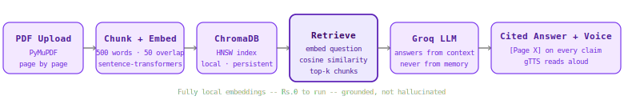

<div align="center">


<br/>

[](https://github.com/Nevil-Dhinoja)
[](https://www.python.org/)
[](https://streamlit.io/)
[](https://groq.com/)
[](https://www.trychroma.com/)
[](LICENSE)
[](https://console.groq.com)

<p align="center">
  
</p>

<br/>

[](https://github.com/Nevil-Dhinoja/rag-research-assistant/stargazers)
&nbsp;
[](https://github.com/Nevil-Dhinoja/rag-research-assistant/fork)

</div>

---



---

## What Is This?

**RAG Research Assistant** is a Retrieval Augmented Generation system that lets you talk to any PDF document. Upload a research paper, report, book, or manual — ask questions in plain English — get answers grounded in the actual document with exact page citations and the source passage shown side by side.

The LLM never answers from general knowledge. Every answer comes from retrieved chunks of your document. If the document does not contain the answer, the system says so.

**Everything runs locally. The entire stack costs $0.**

### Key Stats

| Metric | Value |
|--------|-------|
| Embedding model | sentence-transformers all-MiniLM-L6-v2 — local, CPU |
| Vector database | ChromaDB — persistent, local, no signup |
| LLM | Groq Llama 3.3 70b — free tier |
| Chunking | 500 words, 50-word overlap |
| Retrieval | Top-k cosine similarity search |
| Citation | Page number on every key claim |
| TTS | gTTS reads the answer aloud |
| API Cost | $0 / Rs.0 |

---

## How It Works

```
You upload a PDF
        |
        v
PyMuPDF extracts text page by page
        |
        v
Text split into 500-word chunks with 50-word overlap
(overlap ensures context is never lost at chunk boundaries)
        |
        v
sentence-transformers embeds every chunk locally
(all-MiniLM-L6-v2 running on CPU — no API call, no cost)
        |
        v
ChromaDB stores (chunk_text, embedding, page_number, source)
as a persistent local vector index
        |
        v
You ask a question
        |
        v
Question embedded with the same local model
        |
        v
ChromaDB cosine similarity search returns top-k chunks
        |
        v
Groq Llama 3.3 70b answers ONLY from retrieved chunks
with [Page X] citations on every key claim
        |
        v
gTTS reads the answer aloud
Answer shown left -- source chunks shown right
```

### Why RAG beats a plain LLM call

```
Plain LLM call          RAG system
──────────────          ──────────
Answers from training   Answers from your document
data only               only

May hallucinate facts   Grounded -- if it is not in
not in your document    the document, it says so

No page citations       Every claim cited with [Page X]

Knowledge cutoff        Works with documents published
limits recency          today, yesterday, right now

One generic model       Specialised to your specific
for everything          document's content
```

---

## Features

| Feature | Detail |
|---------|--------|
| PDF ingestion | PyMuPDF extracts text page by page with page metadata |
| Local embeddings | sentence-transformers runs on CPU — no API, no cost, no rate limits |
| Persistent vector store | ChromaDB stores on disk — survives restarts, no re-ingestion needed |
| Citation grounding | Every answer cites [Page X] — verifiable against the source |
| Source panel | Retrieved chunks shown side by side with the answer |
| Multi-document | Index multiple PDFs, query all or filter by document |
| Delete documents | Remove any indexed document from the vector store |
| Voice output | gTTS reads the answer aloud — same pipeline as VoiceSQL |
| Sidebar presets | 7 ready-made research questions to click and run |
| Re-ingestion safe | Uploading the same PDF again replaces old chunks — no duplicates |

---

## Tech Stack

<div align="center">

### Retrieval Layer


**sentence-transformers** — local embedding model, runs on CPU, 384-dimension vectors &nbsp;·&nbsp;
**ChromaDB** — local vector database with HNSW cosine similarity index

### Generation Layer


**Groq Llama 3.3 70b** — answers strictly from retrieved context, never from general knowledge

### Document Processing


**PyMuPDF (fitz)** — fast PDF text extraction with page-level metadata

### Voice + Interface


</div>

---

## Project Structure

```
rag-research-assistant/
├── app/
│   ├── ingestor.py      <-- PDF extraction, chunking, embedding, ChromaDB storage
│   ├── retriever.py     <-- cosine similarity search, chunk formatting
│   ├── qa.py            <-- Groq LLM call with retrieved context + citation prompt
│   ├── voice.py         <-- gTTS text-to-speech
│   ├── main.py          <-- Streamlit UI
│   └── __init__.py
├── data/                <-- Drop PDFs here (gitignored)
├── vectorstore/         <-- ChromaDB persistent storage (gitignored)
├── assets/
│   └── architecture.svg
├── .streamlit/
│   └── config.toml      <-- Silences PyTorch watcher warning
├── .env.example
├── .gitignore
├── requirements.txt
└── README.md
```

---

## Installation & Setup

### Prerequisites

| Software | Version | Purpose |
|----------|---------|---------|
| Python | 3.10+ | Runtime |
| pip | Latest | Packages |
| Groq API Key | Free | LLM generation |

### Clone

```bash
git clone https://github.com/Nevil-Dhinoja/rag-research-assistant
cd rag-research-assistant
```

### Install

```bash
pip install -r requirements.txt
```

First run downloads the sentence-transformers model (~90MB). After that it loads from cache.

### Configure

```bash
cp .env.example .env
```

```env
GROQ_API_KEY=gsk_your_key_here
```

Get your free key at [console.groq.com](https://console.groq.com) — starts with `gsk_`.

### Run

```bash
streamlit run app/main.py
```

Opens at `http://localhost:8501`. Upload any PDF from the sidebar and start asking questions.

---

## Project Internals

<details open>
<summary><strong>app/ingestor.py</strong> — PDF to ChromaDB in 4 steps</summary>

<br/>

**Step 1 — Extract:** `fitz.open(pdf_path)` reads every page, `page.get_text()` pulls the raw text. Returns a list of `{page: N, text: "..."}` dicts.

**Step 2 — Chunk:** Splits each page's text into 500-word windows with 50-word overlap. The overlap is critical — it ensures a sentence split across a chunk boundary still has enough context for the embedding model to represent it correctly.

**Step 3 — Embed:** `SentenceTransformer.encode(texts)` runs all chunks through the local model in one batch. Returns a (num_chunks, 384) numpy array — one 384-dimension vector per chunk.

**Step 4 — Store:** `collection.add(ids, documents, embeddings, metadatas)` writes everything to ChromaDB's HNSW index on disk. Metadata stores `page` and `source` per chunk so citations work at retrieval time.

Re-ingesting the same PDF first deletes all existing chunks for that source before adding new ones — no duplicates.

</details>

---

<details open>
<summary><strong>app/retriever.py</strong> — cosine similarity search</summary>

<br/>

```python
query_embedding = model.encode([query]).tolist()
results = collection.query(
    query_embeddings = query_embedding,
    n_results        = top_k,
    include          = ["documents", "metadatas", "distances"]
)
score = round(1 - distance, 4)   # cosine distance → similarity
```

ChromaDB uses HNSW (Hierarchical Navigable Small World) for approximate nearest neighbour search — it finds the top-k most similar vectors without scanning the entire index. Distance is cosine distance (0 = identical, 2 = opposite). We convert to similarity (1 - distance) so higher = more relevant.

Score interpretation:
- 0.8+ — very high relevance, query is semantically close to chunk
- 0.4-0.8 — good relevance
- Below 0.2 — low relevance, document may not contain the answer

</details>

---

<details open>
<summary><strong>app/qa.py</strong> — grounded generation with citations</summary>

<br/>

The system prompt enforces grounding:

```
- Answer ONLY from the provided context — never from general knowledge
- Always cite the page number like [Page X] after each key point
- If context does not contain enough information, say exactly:
  "The document does not contain enough information to answer this."
```

The user prompt passes the retrieved chunks as context then asks the question. The LLM sees only the retrieved text — not the full document, not its training data. This is what prevents hallucination.

</details>

---

## Troubleshooting

| Error | Fix |
|-------|-----|
| PyTorch watcher warning | Already silenced by `.streamlit/config.toml` |
| TensorFlow oneDNN warnings | Already suppressed by `os.environ` at top of `main.py` |
| Low relevance scores | Normal for technical papers — the model still retrieves the right content |
| `Rate limit 429` | Groq daily limit hit — wait 24 min |
| ChromaDB collection error | Delete `vectorstore/` folder and re-ingest |
| PDF has no extractable text | Scanned PDFs need OCR first — use `pytesseract` |

---

## Roadmap

- [x] PDF ingestion with page-level chunking
- [x] Local embeddings — sentence-transformers on CPU
- [x] ChromaDB persistent vector store
- [x] Groq-powered grounded QA with citations
- [x] gTTS voice output
- [x] Multi-document support with source filtering
- [x] Streamlit UI with source panel
- [x] Hybrid search — BM25 + vector with RRF fusion
- [ ] Reranker — cross-encoder for better precision
- [ ] Highlight source passage in PDF viewer
- [ ] Support for DOCX, TXT, Markdown
- [ ] Chat mode — multi-turn conversation with memory

---

# Why Removing the Grounding Prompt Didn't Make My RAG Hallucinate — It Made It Vague

I expected removing the grounding system prompt from my RAG pipeline to produce obvious hallucinations. Confident wrong numbers. Invented citations. Something clearly broken.

What I got was more subtle — and harder to catch in production.

---

## The setup

The grounding system prompt enforces three constraints:

```python
SYSTEM_PROMPT = """You are a research assistant.
- Answer ONLY from the provided context — never from general knowledge
- Always cite [Page X] after each specific claim
- If the context does not contain enough information, say exactly:
  'The document does not contain enough information to answer this.'"""
```

I replaced this with:

```python
SYSTEM_PROMPT = "You are a helpful assistant."
```

Then asked: **"What accuracy does MAML achieve on few-shot learning benchmarks?"**

---

## What I expected

The LLM answering from training data. Specific benchmark numbers from papers it was trained on. Confident, wrong, no citations.

---

## What actually happened

```
The context does not provide a direct answer to the question of what
accuracy MAML achieves on few-shot learning benchmarks. However, it
mentions that adaptive optimization strategies can enhance convergence
by 2-3 percentage points [Page 8] and that a 20-30% improvement in
convergence rate is suggested [Page 8]. Additionally, it notes that the
N-way K-shot evaluation technique is used to evaluate meta-learning
systems, with 5-way 1-shot and 5-way 5-shot setups being commonly used
[Page 2].
```

The model cited Page 8 and Page 2. It stayed partially grounded in the
retrieved text. It did not invent numbers.

But it also gave a vague, evasive answer that mixed related context
the question didn't ask for. "Convergence rate" and "evaluation technique"
are in the document — but the question was about benchmark accuracy, not
those things. The answer sounds relevant without actually answering.

---

## Why this is harder to catch than hallucination

With the grounding prompt active, the same question returns:

```
Based on the document, the paper does not report specific accuracy
numbers for MAML on standard benchmarks. The proposed framework is
expected to increase robustness by roughly 25% [Page 9] and achieve
6-8 percentage point improvements in cross-domain scenarios [Page 9].
```

Specific, precise, grounded. The model names what it found and
what it didn't find.

Without the grounding prompt, the model does something different.
It knows the question is about MAML benchmarks. It finds related
chunks. It assembles an answer that sounds like it addresses the
question — citing real page numbers from the document — but
actually sidetracks into adjacent topics.

A researcher reading the un-grounded answer might think they got
a real response. They got noise that looks like signal.

---

## The two jobs the grounding prompt does

This experiment revealed that the grounding prompt does not just
prevent hallucination. It does two distinct things:

**Job 1 — prevent fabrication:** Stop the LLM from answering from
training data when the document doesn't contain the answer.

**Job 2 — enforce precision:** Force the LLM to answer the specific
question asked, not related questions it finds easier to answer from
the retrieved context.

Without the prompt, Job 1 was partially preserved — the model still
leaned on retrieved text. Job 2 failed completely — the model answered
the question it wanted to answer, not the question that was asked.

---

## The fix

Precision requirements belong in the prompt explicitly:

```python
SYSTEM_PROMPT = """You are a research assistant.
- Answer ONLY from the provided context — never from general knowledge
- Answer the specific question asked — do not substitute related context
- Always cite [Page X] after each specific claim
- If the exact answer is not in the context, say exactly:
  'The document does not contain enough information to answer this.'
- Do not add context that wasn't asked for"""
```

The addition: **"Answer the specific question asked — do not substitute
related context."** This targets Job 2 directly.

---

## The lesson

Removing the grounding prompt from a RAG system does not turn it into
a confident liar. It turns it into an evasive generalist. It finds
something real in the retrieved text, builds an answer around that,
and presents it as if it addressed your question.

Hallucination is easy to catch. Plausible-but-imprecise is not.

The grounding prompt is not just a safety mechanism. It is a
precision contract between you and the LLM. Every clause earns its place.

---

*This is Break 1 from the RAG Research Assistant Layer 2 experiments.*
*Full break documentation: [BREAKS.md](https://github.com/Nevil-Dhinoja/rag-research-assistant/blob/main/BREAKS.md)*
*Project: [github.com/Nevil-Dhinoja/rag-research-assistant](https://github.com/Nevil-Dhinoja/rag-research-assistant)*

---
## The AI Grid

<div align="center">

This repo is part of a series of open-source AI tools built at zero cost.

| Project | Stack | What it does |
|---------|-------|-------------|
| [VoiceSQL](https://github.com/Nevil-Dhinoja/voice-sql-assistant) | Whisper · LangChain · Groq · gTTS | Speak to your database — voice in, voice out |
| [Data Analyst Agent](https://github.com/Nevil-Dhinoja/data-analyst-agent) | LangChain · Groq · Pandas · fpdf2 | Autonomous e-commerce analyst with PDF reports |
| [ETL Pipeline](https://github.com/Nevil-Dhinoja/etl-pipeline) | PostgreSQL · Pandas · Groq · APScheduler | 7-stage production ETL with AI anomaly detection |
| **RAG Research Assistant** | sentence-transformers · ChromaDB · Groq · gTTS | Upload PDFs — ask questions — get cited answers |
| [Multi-Source RAG](https://github.com/Nevil-Dhinoja/multi-source-rag)| LlamaIndex · ChromaDB · DuckDuckGo | PDF + web + database queried simultaneously |

</div>

---

## License

MIT — free to use, fork and build on.

---

<div align="center">


<br/>

<table border="0" cellspacing="0" cellpadding="0">
<tr>
<td width="180" align="center" valign="top">


</td>
<td width="30"></td>
<td valign="middle">

<h2 align="left">Nevil Dhinoja</h2>
<p align="left"><i>AI / ML Engineer &nbsp;·&nbsp; Full-Stack Developer &nbsp;·&nbsp; Gujarat, India</i></p>
<p align="left">
I build AI systems that are practical, deployable, and free to run.<br/>
This project is part of a larger series of open-source AI tools — each one<br/>
designed to teach a real concept through a working, shippable product.
</p>

</td>
</tr>
</table>

<br/>

[](https://linkedin.com/in/nevil-dhinoja)
[](https://github.com/Nevil-Dhinoja)
[](mailto:dhinoja.nevil@email.com)

<br/>

If this project helped you or saved you time, a star on the repo goes a long way.

<br/>

<br/>


</div>
